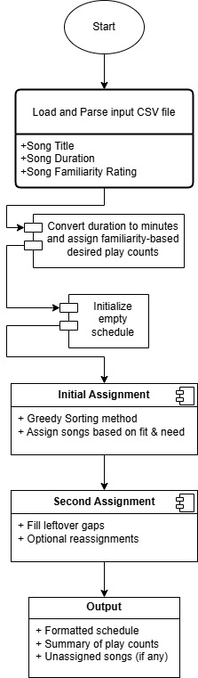
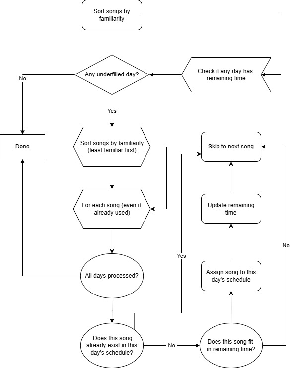

# Dance Scheduler
## Key Requirements 📚: 

1. Total music time per session/day: 1 hr = ~60 min. 
2. Avg song length: ~3 minutes -> 20 songs per session. 
3. Weekly class schedule: 7 days -> 7 sessions. 
4. Total songs: 40 unique songs. 
5. Constraints: 
    i. Every song played at least once per week. 
    ii. No repeats within the same session/day. 
    iii. Familiarity rating influences frequency: 
        higher familiarity → fewer plays; lower familiarity → more plays

## Design Approach 💡 : 

1. Normalize familiarity ratings (custom mapping)

   Scale (1-7) where:
   ```
   1 -> most familiar -> play 1x / week
   7 -> least familiar -> play 7x / week
   ```
   ```
   desired_plays = familiarity_score
   if max_freq = 7, then 
       familiarity 1 -> 1 play
       familiarity 7 -> 7 plays
   ```

   | Familiarity | Plays/Week |
   | ----------- | ---------- |
   | 1           | 1          |
   | 2           | 2          |
   | 3           | 3          |
   | 4           | 4          |
   | 5           | 5          |
   | 6           | 6          |
   | 7           | 7          |

2. Schedule generation algorithm (constraint satisfaction + optimization)
    - Try to distribute each song’s play count across the 7 days. 
    - Ensure no duplicates within a single day. 
    - Prioritize filling each day with ~20 songs, ~60 minutes total.

  Methods examples: greedy heuristics, integer programming, or weighted round-robin scheduling with constraints. 

## Summary 🧠:

scheduler.py: core logic (scheduling, song data)

scheduler_app_drag_n_drop.py: main script

## HIGH-LEVEL OVERVIEW 📌
### Top-Level Structure:

### Greedy Sort Algorithm:

### Second Sort (Fill-In) Algorithm:

### Results:
Displays a simple window with instructions and a button.

Lets the user pick a .csv file.

Processes the file using your existing scheduler logic.

Outputs a .txt file with the results.

Shows a message when it's done.


## Step-by-Step: Package Python GUI as a Mac App ✅ (Tested on Sequoia)


### 1. Install Python 3.10+ (Python 3.12 is tested to be the latest stable ver. Do not use Python 3.13)

There is compatibility issue between Pillow and Python 3.13 — which isn't officially supported by Pillow 10.3.0 yet. 

Python 3.13 is still very new and many libraries haven't fully caught up, as of May 2025.

Use pyenv or Homebrew to ensure proper macOS framework support:

   Using pyenv (recommended)
   ```
   pyenv install 3.10.2 --enable-framework
   pyenv global 3.10.2
   ```

   Or via Homebrew
   ```
   brew install python@3.10
   ```

### 2. Create a Virtual Environment to Isolate Dependencies: 
   ```
   python -m venv venv
   source venv/bin/activate
   ```

### 3. Core Packages
   ```
   pip install tkinterdnd2 pillow pyobjc
   ```

### 4. Development Tools (PyInstaller):
   ```
   pip install pyinstaller
   ```

### 5. Create ```.icns``` file:

   i. Convert ```JPEG``` to ```PNG```

   You can use Preview (built into macOS):

   Open your ```.jpg``` in Preview.
   Go to File > Export.
   Choose Format: ```PNG```.
   Make sure the image is square (e.g., crop to 1024×1024). If it’s not square, the icon will look stretched or cut off.
   Optional: Use a tool like Photoshop, Pixelmator, or any image editor to crop it perfectly.

   ii. Create Icon Set Folder
   ```
   mkdir icon.iconset
   ```
        
   Then, run this script to create all needed icon sizes:
   ```
   sips -z 16 16     icon.png --out icon.iconset/icon_16x16.png
   sips -z 32 32     icon.png --out icon.iconset/icon_16x16@2x.png
   sips -z 32 32     icon.png --out icon.iconset/icon_32x32.png
   sips -z 64 64     icon.png --out icon.iconset/icon_32x32@2x.png
   sips -z 128 128   icon.png --out icon.iconset/icon_128x128.png
   sips -z 256 256   icon.png --out icon.iconset/icon_128x128@2x.png
   sips -z 256 256   icon.png --out icon.iconset/icon_256x256.png
   sips -z 512 512   icon.png --out icon.iconset/icon_256x256@2x.png
   sips -z 512 512   icon.png --out icon.iconset/icon_512x512.png
   sips -z 1024 1024 icon.png --out icon.iconset/icon_512x512@2x.png
   ```
   Replace ```icon.png``` with your converted PNG filename.

   iii. Convert to ```.icns``` 
   ```
   iconutil -c icns icon.iconset
   ```
   This will generate ```icon.icns``` in the same folder.

### 6. Prepare Project Structure:

   Ensure your directory contains:
   
   ├── scheduler_app_drag_n_drop.py  # Main script
   
   ├── scheduler.py                 # Core logic
   
   ├── app_icon.icns                # macOS icon
   
   └── app_icon.png                 # Fallback icon

### 7. Build the App:
   
   i. Run PyInstaller

   Use this command to bundle the app:
   ```
   pyinstaller \
       --windowed \
       --icon=app_icon.icns \
       --hidden-import=Foundation \
       --hidden-import=tkinterdnd2 \
       --add-data="app_icon.png:." \
       --add-data="scheduler.py:." \
       --name "Dance_Scheduler" \
       --osx-bundle-identifier "com.yourname.dancescheduler" \
       scheduler_app_drag_n_drop.py
   ```

   ii. Alternative: Use a ```.spec``` File

   For advanced control, create ```build.spec``` (template) and run:
   ```
   pyinstaller build.spec
   ```

### 8. Test the App: 

   From Terminal (Debug Mode)
   ```
   dist/Dance_Scheduler.app/Contents/MacOS/Dance_Scheduler
   ```
    
   From Finder, double-click
   ```
   dist/Dance_Scheduler.app
   ```

   Check for Errors. If the app crashes:

   i. Inspect logs in ```~/dancescheduler_log.txt```.

   ii. Verify all files are bundled in ```Contents/Resources/```.

### 9. Distribute the App:
    
i. Code Signing (Mandatory for macOS)
    
Sign the app to avoid Gatekeeper warnings:

```
codesign --deep --force --verify --verbose --sign "Developer ID Application: Your Name (TEAMID)" dist/Dance_Scheduler.app
```

ii. Create a DMG Installer
    
Package for distribution:

```
hdiutil create -volname "Dance Scheduler" -srcfolder dist/Dance_Scheduler.app -ov -format UDZO Dance_Scheduler.dmg
```

iii. Optional: Notarize (App Store)
    
Required for macOS Catalina+:

```
xcrun altool --notarize-app --primary-bundle-id "com.yourname.dancescheduler" --username "your_apple_id" --password "@keychain:AC_PASSWORD" --file Dance_Scheduler.dmg
```

### 10. Maintenance & Future Proofing:
    
i. Update dependencies

Save them to ```requirements.txt```
```
pip freeze > requirements.txt
```

📝 In the future, we can install dependencies by
```
pip install -r requirements.txt
```

ii. Rebuild after modifications
```
./build.sh
```

🚨 Note: when implementing ```build.sh```, run
```
chmod +x build.sh
```
to ensure proper file permissions. 

Alternatively, run
```
chmod 644 *.py *.png *.icns
```
to make all files accessible. 

iii. Manual Option: 

Clean and rebuild
```
rm -rf build dist
```
```
pyinstaller \
    --windowed \
    --icon=app_icon.icns \
    --hidden-import=Foundation \
    --hidden-import=tkinterdnd2 \
    --add-data="app_icon.png:." \
    --add-data="scheduler.py:." \
    --name "Dance_Scheduler" \
    --osx-bundle-identifier "com.yourname.dancescheduler" \
    scheduler_app_drag_n_drop.py
```

### 11. Final Directory Structure
    
    dance-scheduler/
    
    ├── build/                  # PyInstaller temp files
    
    ├── dist/                   # Final app bundle
    
    └── Dance_Scheduler.app
    
    ├── venv/                   # Virtual environment
    
    ├── scheduler_app_drag_n_drop.py
    
    ├── scheduler.py
    
    ├── app_icon.icns
    
    ├── app_icon.png
    
    └── requirements.txt
    
## Example User Input Template

|  | 曲名                   | 时长     | 熟悉度 |
|------|------------------------|----------|--------|
| 1    | 马兰花                 | 4:22:00  | 7      |
| 2    | 天边                   | 4:21:00  | 7      |
| 3    | 美人                   | 3:46:00  | 7      |
| 4    | 花月夜                 | 4:14:00  | 7      |
| 5    | 风带走的               | 3:44:00  | 6      |
| 6    | 美人吟                 | 4:29:00  | 6      |
| 7    | 世界赠予我的           | 4:01:00  | 5      |
| 8    | 乌兰巴托的夜           | 3:35:00  | 5      |
| 9    | 别有天                 | 4:15:00  | 4      |
| 10   | 苹果香                 | 2:48:00  | 4      |
| 11   | 又见江南雨             | 4:29:00  | 3      |
| 12   | 梅花赋                 | 3:48:00  | 3      |
| 13   | 黄梅悠悠               | 3:27:00  | 3      |
| 14   | 相思月                 | 4:22:00  | 2      |
| 15   | 只留清香春来报         | 4:04:00  | 2      |
| 16   | 西班牙斗牛舞           | 3:29:00  | 2      |
| 17   | 彩云之南               | 4:33:00  | 2      |
| 18   | 上春山                 | 2:32:00  | 2      |
| 19   | 爱在纳木错             | 3:24:00  | 2      |
| 20   | 雨巷佳人               | 4:42:00  | 2      |
| 21   | 花又落                 | 4:30:00  | 2      |
| 22   | 黄河水从我家门前过     | 4:28:00  | 1      |
| 23   | 枕着光的她             | 3:10:00  | 1      |
| 24   | 心愿                   | 5:32:00  | 1      |
| 25   | 故乡情                 | 4:14:00  | 1      |
| 26   | 站在草原望北京         | 3:13:00  | 1      |
| 27   | 莫日格勒河             | 4:33:00  | 1      |
| 28   | 牧羊女神               | 3:47:00  | 1      |
| 29   | 微藤花                 | 3:44:00  | 1      |
| 30   | 我的玫瑰卓玛拉         | 3:31:00  | 1      |
| 31   | 天边的巴拉格宗         | 4:32:00  | 1      |
| 32   | 花开的地方             | 4:10:00  | 1      |
| 33   | 醉乡                   | 2:44:00  | 1      |
| 34   | 阿瓦尔古丽             | 4:48:00  | 1      |
| 35   | 水边的格桑梅朵         | 3:58:00  | 1      |
| 36   | 梦回草原               | 4:30:00  | 1      |


### 🔑 Key Notes

  Icons: Use ```.icns``` for macOS (512x512px, multiple resolutions).
    
  Threading: Avoid threading for GUI updates; use Tkinter's ```after()``` method.
    
  macOS Permissions: Ensure your app has NSDocumentsFolderUsageDescription in ```Info.plist``` if accessing files.


### 🩺 Issues Regarding macOS Monterey

Downgrade PyObjC
```
pip uninstall pyobjc pyobjc-core
pip install pyobjc==9.2    
```

Ensure tkinterdnd2 is Monterey-ready
```
pip install --force-reinstall tkinterdnd2==0.3.0
```

    
